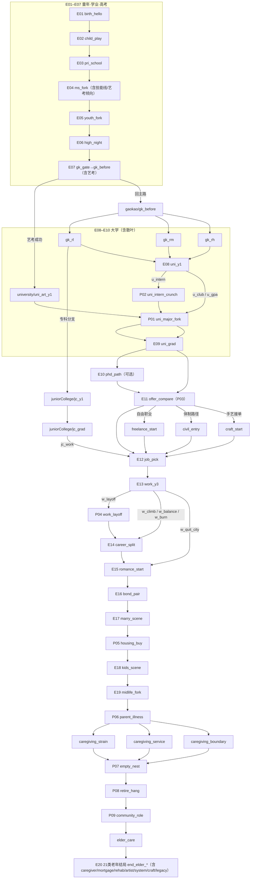

# 事件与分支编写指南（草稿）

> **状态**：草稿，未并入 `DEVELOPER.md`。确认与修改后再正式纳入仓库主文档。

本文面向在 `content/story.json` 中编排**阶段 → 场景 → 选项**的写作者，与当前引擎契约（`src/engine/schema.ts` + `scripts/validate-story.ts`）一致。

---

## 1. 结构总览

| 层级 | 文件字段                                                                                 | 说明                                                            |
| ---- | ---------------------------------------------------------------------------------------- | --------------------------------------------------------------- |
| 故事 | `meta`、`initial`、`stages[]`                                                      | 单文件承载全文；`meta.start` 为入口 `stageId` + `sceneId` |
| 阶段 | `stages[].id`、`title`、`scenes[]`                                                 | 人生阶段（时间轴上的「章」），`id` 需稳定、可引用             |
| 场景 | `scenes[].id`、`narrative`、`choices?`、`onEnter?`、`autoNext?`、`isEnding?` | 玩家停留的一屏叙事单位                                          |
| 选项 | `choices[]` 内每条 `Choice`                                                          | 玩家点击或键盘数字选择；可带效果、检定、显隐条件                |

**导航**：用 `next`（`Next`）从选项或检定区间跳到下一 `scene` 或跨 `stage`。同阶段内跳转可用 `{ "kind": "scene", "sceneId": "..." }`（可选 `stageId`）；跨阶段用 `{ "kind": "stage", "stageId": "...", "sceneId": "..." }`。

---

## 2. 全局状态（写分支前必懂）

初始值来自 `initial`，运行中由 `effects` 修改。

- **`stats`**（固定六维）：`stress`、`healthDebt`、`support`、`wealth`、`career`、`luck`。除 `healthDebt` 外 UI 常作 0–100 量纲理解；`healthDebt` 为非负累积。
- **`flags`**：`Record<string, boolean>`，适合「不可逆决断」（如「考上某校」）。
- **`tags`**：`string[]`，适合可叠加的习惯或长期标签（如与熬夜、压力相关）。

编写时：**命名用英文蛇形或简短英文**，避免与现有 `op`/字段拼写冲突；改稿时用全局搜索检查引用是否一致。

---

## 3. 选项 `Choice` 怎么写

每条至少包含：

- **`id`**：本场景内唯一（建议 `场景缩写_动作`，如 `gk_enter`）。
- **`label`**：玩家看到的文案。

可选字段：

| 字段            | 用途                                                                   |
| --------------- | ---------------------------------------------------------------------- |
| `effects`     | 选后立即应用的一组 `Effect`（见第 4 节）                             |
| `next`        | 无检定时**必须**：选后跳转目标                                   |
| `check`       | 阈值检定（见第 5 节）；有时**不要**根级 `next`，由检定区间导航 |
| `visibleWhen` | 仅当条件满足时显示该选项（分流、门槛）                                 |

### 3.1 条件显示 `visibleWhen`

满足**所有**已写字段时才显示（逻辑与 `src/engine/choiceVisibility.ts` 一致）：

- `tag`：全局 `tags` 中须包含该字符串。
- `flag`：若 `value` 为 **true**，须 `flags[key] === true`；若 `value` 为 **false**，则仅在 **`flags[key] === true` 时隐藏**（未写入的键视为「非 true」，避免「只写了结婚为 true、未写未婚」导致未婚选项全部不可见）。
- `statMax`：对应 `stats[stat] <= value`（高于则隐藏）。
- `statMin`：对应 `stats[stat] >= value`（低于则隐藏）。

用于：中后期根据标签/标志/属性门槛展开不同选项，而不必复制整段场景。

---

## 4. 效果 `Effect`（`op`）

| `op`        | 字段                       | 含义                                           |
| ------------- | -------------------------- | ---------------------------------------------- |
| `addStat`   | `stat`, `value`        | 数值加减                                       |
| `setStat`   | `stat`, `value`        | 设为绝对值                                     |
| `clampStat` | `stat`, `min`, `max` | 夹逼到区间                                     |
| `setFlag`   | `key`, `value`         | 布尔决断点                                     |
| `addTag`    | `tag`                    | 追加标签（勿重复依赖引擎去重，习惯上策划自控） |
| `removeTag` | `tag`                    | 移除标签                                       |

**延迟后果**：没有单独的「延迟」语法；通过 **早期 `addTag` / `addStat`**，在 **后期场景的 `visibleWhen` 或叙事** 中体现，即「数据上连续、叙事上分期」。

---

## 5. 检定 `check`（`threshold`）

用于高考、面试等「一次掷骰、多档结果」：

- **`bands`**：若干 `{ min, max, label, next, effects? }`，与**结算分**比较；**所有区间的并集应覆盖 0–100**，否则运行时会报错。
- **`modifiers`**：可选，影响最终分数（如按 `career` 加权、`stressPenalty`、`luckWeight` 等，以代码实现为准）。

有 `check` 的选项：玩家选择后先出检定结果 UI，再导航到对应 `band` 的 `next`；根级可无 `next`。

---

## 6. 场景级：`onEnter` 与 `autoNext`

- **`onEnter`**：进入该场景时自动执行的一组 `Effect`（无需点击选项）。适合「到龄默认发生」「纯叙事扣属性」。
- **`autoNext`**：`{ next, delayMs? }`，叙事展示后自动跳转（`delayMs` 由 UI 使用，默认约 600ms）。用于纯过场、无选项推进。

---

## 7. 终局

- 将场景的 **`isEnding`** 设为 `true`，引擎会把 `phase` 切到结局界面。
- 该场景的 **`narrative`** 仍会在结局页作为可展示内容（与当前 `EndingScreen` 行为一致）。

---

## 8. 分支设计实务建议

1. **主 spine + 旁支**：用 `docs/story-routes.json` 一类摘要维护「主干时间线」，分支用 `branches.*` 记录关键岔路，避免 JSON 里迷路。
2. **汇聚**：不同 `next` 可指向同一后续 `sceneId`，靠 `flags`/`tags` 区分台词或小额 `onEnter` 差分。
3. **校验**：改稿后运行 `npm run validate:story`，避免拼错 `stageId`/`sceneId` 或 schema 违规。
4. **单局时长**：控制 `narrative` 总字数与选项屏数，与产品「约 3～5 分钟」对齐（见 `DEVELOPER.md`）。

---

## 9. 与代码的对应关系（便于检索）

| 概念     | 代码入口                                                          |
| -------- | ----------------------------------------------------------------- |
| Schema   | `src/engine/schema.ts`                                          |
| 选并解析 | `src/engine/machine.ts`（`selectChoice`、`resolveNext` 等） |
| 选项显隐 | `src/engine/choiceVisibility.ts`                                |
| 故事载入 | `src/store/gameStore.ts`（`content/story.json`）              |

---

## 10. 检定维度（策划语言）与数值如何驱动事件

本节用**四条策划向维度**描述玩家状态；引擎当前只认 `schema` 里的 `stats` / `flags` / `tags`（见第 2 节）。写作时先在脑内用四维思考，再在 JSON 里落到**具体字段**（见 10.1 映射）。维度本身不单独出现在 JSON 里，而是通过 **隐性的 `effects`** 改写数值，再通过 **`visibleWhen`**、**`onEnter`**、**检定 `modifiers`** 决定「哪些事件能刷出 / 被隐藏」「检定更容易进哪一档」。

| 策划维度 | 含义（玩家未必直接看到数字） | 典型隐性后果（示例） |
| -------- | ----------------------------- | -------------------- |
| **知识** | 课业、应试资本的积累 | 同一场景里选「多刷一科」会 +知识，利于后续检定加分档 |
| **健康** | 慢性消耗、病弱负担（越高越糟时，用负债型数值表示） | 熬夜、透支会 **恶化** 健康维度，后期可能锁出「就医/休养」线 |
| **压力** | 心态承压、焦虑 | 压力越高，同一场 **大考检定** 越容易落入「发挥失常」区间（靠 `stressPenalty` 等修饰符实现） |
| **体质** | 体能与恢复力，影响「扛不扛得住」高压日程 | 体质差时，同样熬夜对健康伤害更大；也可用于解锁「体育/医务」类选项 |

**刷出 / 隐藏事件** 的常用手段：

- **`visibleWhen.statMin` / `statMax`**：例如压力持续高于某阈值 → 出现「家长谈心」「心理咨询」选项；健康负担过高 → 出现「强制复查」场景入口。
- **`visibleWhen.tag`**：隐性选「连续熬夜」后打上 `tag`，后期某屏只对有该标签的玩家展示「身体报警」叙事。
- **`visibleWhen.flag`**：某次检定失败后 `setFlag`，后续场景从主线里**换皮**为补考/复读分支。

**阈值触发新分支**：当某一维（映射后的 `stat`）跨过策划预设的上下限时，**不自动跳转**——须通过在目标选项或场景的 `visibleWhen` 上写条件，让玩家「在满足条件时才看见这条路」，等价于「新事件分支被刷出」。

---

### 10.1 与当前引擎 `stats` 的映射（建议）

当前 `StatKeySchema` 为六维：`stress`、`healthDebt`、`support`、`wealth`、`career`、`luck`。四维策划语言可按下表落到 JSON（若日后 schema 扩展专用字段，再替换映射即可）。

| 策划维度 | 建议映射 | 说明 |
| -------- | -------- | ---- |
| **知识** | `career` | 叙事上视为「学业/应试资本」；`addStat career` 表示隐性涨知识 |
| **健康** | `healthDebt` | **负债型**：数值越高表示健康越差；「对健康 −1」在数据上常写作 `addStat healthDebt` 为 **正**（负担增加） |
| **压力** | `stress` | 与策划直觉一致；压力高用于 `statMin` 门槛或检定 `stressPenalty` |
| **体质** | `luck` + 可选 `tags` | 可用 `luck` 表示临场身体状态与恢复力；若需更强语义，可配合 `addTag: 体质透支` 等，用 `visibleWhen.tag` 锁分支 |

**检定如何把维度算进去**：在 `check.threshold.modifiers` 中，用 `addStatWeights` 给 `career`（知识）加权、`stressPenalty` 吃压力惩罚、`luckWeight` 关联体质/运气等（具体公式以 `src/engine` 检定实现为准）。策划表上写清：**「压力越高 → 扣分越多 → 越容易进低分 band」** 即可与实现对齐。

---

## 11. 完整事件链（`content/story.json`）

**权威数据源**：[`content/story.json`](../content/story.json)（`meta.version`）；改稿后务必运行 `npm run validate:story`。

`meta.version` 为 **2.7.0**，`estimatedMinutes` 为 **[8, 15]**。以下与当前 JSON **意图对齐**；**20 个交互点**用代号 **E01–E20** 标识（每个代号对应**至少一次玩家决策或一次检定**）。

**收束侧重**：无中途提前结局；主线推进至 **`elder_care`**，再在 **十四类「老年生活」结局**（`end_elder_*`）中择一收束（见 §11.2 结局库）。**v2.2.0** 起：`ms_fork` 增 **`ms_voc`（技能线）**；`midlife_fork` 各选项带 **中年标签**（`还乡晚年` / `都市扎根` / `余热创业`）；`elder_care` 增 **标签/高支持** 驱动的额外收束；`visibleWhen.flag` 对 **`false`** 的判定见 §3.1（未写入的布尔 flag 不阻塞「未婚/未育」类选项）。**v2.3.0** 起：高考检定 **`bandMode: stressSplit`**（智商/积淀 + 压力动态分界，UI 不展示骰值，见 §11.3）。

**入口**：`birth` / `birth_hello`。

### 11.1 初始状态（`initial`）

| 字段 | 初值 |
|------|------|
| `stress` | 10 |
| `healthDebt` | 0 |
| `support` | 55 |
| `wealth` | 25 |
| `career` | 12 |
| `luck` | 50 |

---

### 11.2 交互点代号一览（E01–E20）

| 代号 | 场景 `sceneId` | 主题 | 选项数 / 备注 |
|------|----------------|------|----------------|
| **E01** | `birth_hello` | 诞生 | 1：推进时间 |
| **E02** | `child_play` | 幼年 | 1：进小学 |
| **E03** | `pri_school` | 小学 | 3：`pri_focus` / `pri_wide` / `pri_balance` |
| **E04** | `ms_fork` | 中学分流 | 4：`ms_key` / `ms_norm` / `ms_art` / **`ms_voc`**（`tag` **技能线**） |
| **E05** | `youth_fork` | 初高中主轴 | 2：`y_gaokao` / `y_life` |
| **E06** | `high_night` | 高三熬夜 | 2：`grind_late` / `rest_ok` |
| **E07** | `gk_gate` → `gk_before` | **高考节点**（含艺考分支 + 高考检定） | 入口 `gk_gate`：若有 `tag` **艺考倾向** 可走 `gk_try_art`（`art_exam`）或 `gk_to_exam`；随后 `gk_before`：`gk_enter` → `gaokao_main` 三档 |
| **E08** | `uni_y1` | 大学一年级 | 3：`u_club` / `u_gpa` / `u_intern`；其中 `u_intern` → **P02** `uni_intern_crunch`；其余两项（及艺考成功 `uni_art_y1`）→ **P01** `uni_major_fork` |
| **E09** | `uni_grad` | 毕业去向 | 3：`u_phd` / `u_work` / `u_public`（毕业前会经过 **P01** 专业岔路；实习线会经过 **P02**） |
| **E10** | `phd_path` **或** 跳过 | 读研出站 | **若选 `u_phd`**：`phd_faculty` / `phd_corp` 均 → **P03** `offer_compare`（学术志向写入 `academic` + `学术线`）；**若未读研** 本点不存在 |
| **E11** | `offer_compare` | 机会取舍（P03） | 3～6：平台/匹配/现金流；条件分支：自由职业（作品集驱动）/体制倾向/证书流 → 对应起步场景 |
| **E12** | `job_pick` | 第一份工作 | 3：`j_big` / `j_startup` / `j_stable` |
| **E13** | `work_y3` | 工作第三年 | 2～5：`w_climb` / `w_balance`；**P04**：`w_layoff`（`stress≥50` 且 `wealth≤40`）→ `work_layoff`；条件项 `w_burn` / `w_quit_city` |
| **E14** | `career_split` | 事业中期 | 最多 3：`c_mogul` / `c_go_on` / `c_academic`（无中途结局，均继续） |
| **E15** | `romance_start` | 如何脱单 | 3：`r_active` / `r_blind` / `r_solo` |
| **E16** | `bond_pair` | 关系推进 | 3：`b_fast` / `b_slow` / `b_end` |
| **E17** | `marry_scene` → `housing_buy` | 婚否 + 住房决策（P05） | `m_yes/m_no` 后进入 `housing_buy`（买房/租房/回到家附近）再到 `kids_scene` |
| **E18** | `kids_scene` | 生育 / 丁克 / 延展 | 已婚：`k_yes` / `k_dink`；未婚：`k_skip`；条件 **`k_continue_warm`** 仍继续主线 |
| **E19** | `midlife_fork` | 中年后半程（P06–P09 扩展树） | `midlife_fork` 后进入 P06，并在照护/空巢/退休/社群节点出现多分支（见 §11.2.1 与 §11.5） |
| **E20** | **结局库** | **二十一类** `isEnding`（均为**老年生活**主题） | 见下表（新增 `end_elder_artist` / `end_elder_system` / `end_elder_craft_brand`） |

### 11.2.1 分支速查（入口 / 触发 / 去向）

本节把“树上真正会分叉的地方”单独列出来，便于策划快速定位与回归测试。

- **艺考分支（高考入口）**
  - **入口**：`gaokao/gk_gate`
  - **触发**：需 `tag` **艺考倾向**（中学 `ms_art` 写入）
  - **去向**：
    - 成功：`university/uni_art_y1`（写入 `flag: art_admit=true` + `tag: 艺术院校`）
    - 失败：回 `gaokao/gk_before` 继续高考

- **专科分支（高考失常+低学业积淀）**
  - **入口**：`gaokao/gk_rl` 的 `from_rl_jc`
  - **触发**：`gk_tier=false` 且 `career≤42`
  - **去向**：`juniorCollege/jc_y1` → `jc_grad` → `careerEarly/job_pick`（可选 `jc_upgrade` 回 `university/uni_y1`）

- **P01 专业岔路**
  - **入口**：`university/uni_major_fork`
  - **触发**：固定进入（由 `uni_y1` 的 `u_club/u_gpa`、`uni_intern_crunch`、`uni_art_y1` 汇入）
  - **去向**：理工/商科/人文（写入对应 `tag`），艺考成功可选「作品集驱动」（需 `art_admit=true`）

- **P02 实习高压**
  - **入口**：`university/uni_intern_crunch`
  - **触发**：`uni_y1` 选择 `u_intern`
  - **去向**：两选项回 `uni_major_fork`（卷→`stress/healthDebt`↑；立边界→`stress`↓、`support`↑）

- **P03 Offer 取舍**
  - **入口**：`careerEarly/offer_compare`
  - **触发**：`uni_grad` 选 `u_work/u_public`；以及专科 `jc_grad` 选 `jc_work`
  - **去向**：平台/匹配/现金流 → `job_pick`；此外在满足条件时可进入更独特的起步分支（仍会快速汇入主线）：
    - **自由职业**：需 `tag` **作品集驱动** → `careerEarly/freelance_start`（写入 `tag: 自由职业`）
    - **体制路径**：需 `tag` **体制倾向** → `careerEarly/civil_entry`（写入 `tag: 体制内`）
    - **手艺接单**：需 `tag` **证书流** → `careerEarly/craft_start`（写入 `tag: 工匠口碑/招牌手艺`）

- **P04 裁员/转向**
  - **入口**：`careerEarly/work_y3` 的 `w_layoff`
  - **触发**：`stress≥50` 且 `wealth≤40`
  - **去向**：`careerEarly/work_layoff` → `careerMid/career_split`（补偿休整/转技能/靠关系）

- **P05 住房决策**
  - **入口**：`familyRing/housing_buy`
  - **触发**：`marry_scene` 后固定进入
  - **去向**：买房（需 `wealth≥30`，写入 `tag: 房贷`）/租房（`tag: 租房生活`）/回家附近（`support`↑）→ `kids_scene`

- **P06–P09 中年链**
  - **入口**：`lifeLate/midlife_fork`
  - **触发**：从 `midlife_fork` 进入 `parent_illness`，随后在照护/空巢/退休/社群节点出现**多分支**（并最终汇入 `elder_care`）：
    - `parent_illness` → `caregiving_strain` / `caregiving_service` / `caregiving_boundary`
    - `empty_nest` 增加 `en_grandchild`（需 `parent=true`）
    - `retire_hang` 增加 `rt_health`（需 `healthDebt≥30`）
    - `community_role` 增加 `cr_mentor`（需 `career≥55`）
  - **关键门槛**：`parent_illness` 的用钱换时间需 `wealth≥40`；`retire_hang` 的规划退休需 `wealth≥46`；`community_role` 的接过角色需 `support≥58`

- **P10 留下火种结局**
  - **入口**：`lifeLate/elder_care` 的 `elder_cap_legacy`
  - **触发**：`luck≥65`
  - **去向**：`ending/end_elder_legacy`

- **新增老年结局入口（中年事件直连的差分）**
  - **`elder_cap_caregiver`**：需 `tag` **照护者** → `end_elder_caregiver`
  - **`elder_cap_mortgage`**：需 `tag` **房贷** 且 `wealth≤35` → `end_elder_mortgage`
  - **`elder_cap_rehab`**：需 `tag` **康复计划** → `end_elder_rehab`

**结局库**（均在 `stageId: ending`，且仅能从 **`elder_care`** 进入；无中途提前结局）。

| 结局 `sceneId` | 叙事侧重 | 典型触发（`elder_care` 选项） |
|----------------|----------|------------------------------|
| `end_elder_quiet` | 寻常晚年、细水长流 | **`elder_cap_quiet`**（无条件，兜底） |
| `end_elder_family` | 亲情环绕、含饴弄孙 | **`elder_cap_family`**（`parent`） |
| `end_elder_solo` | 独身亦自足 | **`elder_cap_solo`**（`tag` **独身倾向**） |
| `end_elder_scholar` | 讲台/书桌到老年 | **`elder_cap_scholar`**（`academic`） |
| `end_elder_affluent` | 物质宽裕的晚年 | **`elder_cap_affluent`**（`wealth≥52`） |
| `end_elder_hometown` | 换城/熟人社会养老 | **`elder_cap_hometown`**（`freedom_path`） |
| `end_elder_health_note` | 带病亦平和 | **`elder_cap_body`**（`healthDebt≥32`） |
| `end_elder_metro` | 仍扎都市 | **`elder_cap_metro`**（`tag` **都市扎根**） |
| `end_elder_return` | 还乡节奏 | **`elder_cap_return`**（`tag` **还乡晚年**） |
| `end_elder_second_wind` | 余热/副业不息 | **`elder_cap_second_wind`**（`tag` **余热创业**） |
| `end_elder_couple_duo` | 二人世界到老 | **`elder_cap_duo`**（`tag` **二人世界**） |
| `end_elder_solo_midlife` | 独自走过中年至终章 | **`elder_cap_wander_mid`**（`tag` **独自走过中年**） |
| `end_elder_craftsman` | 手艺人晚年 | **`elder_cap_crafts`**（`tag` **技能线**） |
| `end_elder_community` | 人情互助网 | **`elder_cap_community`**（`support≥62`） |
| `end_elder_caregiver` | 照护余生 | **`elder_cap_caregiver`**（`tag` **照护者**） |
| `end_elder_mortgage` | 还贷到老 | **`elder_cap_mortgage`**（`tag` **房贷** 且 `wealth≤35`） |
| `end_elder_rehab` | 养回身体 | **`elder_cap_rehab`**（`tag` **康复计划**） |
| `end_elder_artist` | 创作到老 | **`elder_cap_artist_late`**（`tag` **自由职业**） |
| `end_elder_system` | 体制晚年 | **`elder_cap_system_late`**（`tag` **体制内**） |
| `end_elder_craft_brand` | 招牌手艺 | **`elder_cap_craft_late`**（`tag` **招牌手艺**） |
| `end_elder_legacy` | 留下一点东西 | **`elder_cap_legacy`**（`luck≥65`） |

---

### 11.3 高考节点 `gk_gate → gk_before`（E07）

- **入口场景 `gk_gate`**：  
  - 若曾在中学选择 `ms_art`（打 `tag: 艺考倾向`），则出现 `gk_try_art`：进行一次 `threshold` 检定 `art_exam`（static）。  
    - **成功**：进入 `university/uni_art_y1`，并写入 `flag: art_admit = true` + `tag: 艺术院校`，后续在大学/择业叙事可据此差分。  
    - **失败**：回到 `gk_before` 继续高考。  
  - 永远可选 `gk_to_exam`：直接进入 `gk_before`。  

- **高考检定 `gk_before`**：选项 `gk_enter`，检定 id `gaokao_main`，`bandMode`：**`stressSplit`**（见 `src/engine/check.ts`）。  
- **双维度**：  
  - **智商（叙事）**：由 `stats.career`（学业积淀）映射为展示的「叙事智商」`iqDisplay`，并决定 **卷面基准分** `baseScore`（`gaokaoBaseScoreFromCareer`）。  
  - **压力**：**不**再进入 `stressPenalty` 扣结算分；改为 **动态三档分界** `computeStressSplitEdges(stress)`：压力低时接近旧版 0–26 / 27–72 / 73–100；压力升高时失常档上界随 `≈压力/2` 放宽、超常档下界随压力抬高（具体以代码为准）。  
- **内部检定分**（0–100）：`rawRoll` + 修正（`career` 加权 + `luck` 加权），再落入上式三档之一，对应 JSON 中 **顺序固定** 的三条 `bands`（失常 / 正常 / 超常）的 `next` 与 `effects`。  
- **界面**：不向玩家展示骰值与内部结算分；展示叙事智商、基准分、临场波动、折算总分（见 `CheckToast` + `CheckResolution.hideDice`）。  
- 三档结果场景各 **1 个 continue 选项** 进入 `uni_y1`（属性修正不同）；`gk_rl` 额外包含 **专科分支** `from_rl_jc`（仅在 `gk_tier=false` 且 `career≤42` 时出现）→ `juniorCollege/jc_y1`。

### 11.3.1 占位事件节点与世界树（策划参考）

事件树的“主干+散叶”设计动机与节点清单详见 **[`WORLD_TREE_PLACEHOLDERS.draft.md`](WORLD_TREE_PLACEHOLDERS.draft.md)**（其中 P01–P10 现已全部实装；文档用于记录每个节点的设计意图与影响方向）。

---

### 11.4 条件选项速查（`visibleWhen`）

| 场景 | 选项 `id` | 条件 |
|------|-----------|------|
| `ms_fork` | `ms_voc` | （无额外门槛，打 `tag` **技能线**） |
| `gk_gate` | `gk_try_art` | `tag` **艺考倾向** |
| `work_y3` | `w_burn` | `stress` **≥ 52** |
| `work_y3` | `w_quit_city` | `wealth` **≤ 45** |
| `work_y3` | `w_layoff` | `stress` **≥ 50** 且 `wealth` **≤ 40** |
| `career_split` | `c_mogul` | `wealth` **≥ 38** |
| `career_split` | `c_academic` | 含 `tag` **读研** |
| `kids_scene` | `k_yes` / `k_dink` | `flag` **married = true** |
| `kids_scene` | `k_skip` | `flag` **married = false** |
| `kids_scene` | `k_continue_warm` | `married` 且 **`support` ≥ 58** |
| `midlife_fork` | `mid_start` | `wealth` **≥ 32** |
| `uni_major_fork` | `m_art_track` | `flag` **art_admit = true** |
| `housing_buy` | `hb_buy` | `wealth` **≥ 30** |
| `parent_illness` | `pi_money` | `wealth` **≥ 40** |
| `retire_hang` | `rt_plan` | `wealth` **≥ 46** |
| `retire_hang` | `rt_health` | `healthDebt` **≥ 30** |
| `community_role` | `cr_take` | `support` **≥ 58** |
| `community_role` | `cr_mentor` | `career` **≥ 55** |
| `elder_care` | `elder_cap_family` | `flag` **parent = true** |
| `elder_care` | `elder_cap_solo` | 含 `tag` **独身倾向** |
| `elder_care` | `elder_cap_scholar` | `flag` **academic = true** |
| `elder_care` | `elder_cap_affluent` | `wealth` **≥ 52** |
| `elder_care` | `elder_cap_hometown` | `flag` **freedom_path = true** |
| `elder_care` | `elder_cap_body` | `healthDebt` **≥ 32** |
| `elder_care` | `elder_cap_metro` | `tag` **都市扎根** |
| `elder_care` | `elder_cap_return` | `tag` **还乡晚年** |
| `elder_care` | `elder_cap_second_wind` | `tag` **余热创业** |
| `elder_care` | `elder_cap_duo` | `tag` **二人世界** |
| `elder_care` | `elder_cap_wander_mid` | `tag` **独自走过中年** |
| `elder_care` | `elder_cap_crafts` | `tag` **技能线** |
| `elder_care` | `elder_cap_community` | `support` **≥ 62** |
| `elder_care` | `elder_cap_caregiver` | `tag` **照护者** |
| `elder_care` | `elder_cap_mortgage` | `tag` **房贷** 且 `wealth` **≤ 35** |
| `elder_care` | `elder_cap_rehab` | `tag` **康复计划** |
| `elder_care` | `elder_cap_artist_late` | `tag` **自由职业** |
| `elder_care` | `elder_cap_system_late` | `tag` **体制内** |
| `elder_care` | `elder_cap_craft_late` | `tag` **招牌手艺** |
| `elder_care` | `elder_cap_legacy` | `luck` **≥ 65** |
| `elder_care` | `elder_cap_quiet` | （无条件，始终可选） |

---

### 11.5 事件树（结构示意）

下图压缩了 **阶段合并与中途结局**；实线为主轴，虚线为**条件跳转至结局**。

**读图说明**：

- **E10**：仅当 `uni_grad` 选择 **`u_phd`** 时出现 `phd_path`；两选项均汇入 **E11**（`offer_compare`）。  
- **E13**：`w_burn` / `w_quit_city` 不再进中途结局；分别汇入 **E14** 或 **E15**。  
- **E14**：`c_mogul` / `c_academic` / `c_go_on` 均进入 **E15**，主线继续。  
- **E17**：`m_yes/m_no` 先到 `housing_buy`（P05）再到 `kids_scene`。  
- **E19**：中年后半程在 P06 出现多分支后汇入；在 `elder_care` 按条件展示多条老年收束；**二十一类结局均为老年生活主题**（多条件可同时满足时，玩家择一收束）。

---

*草稿版本随 `content/story.json` 演进需同步修订。*
