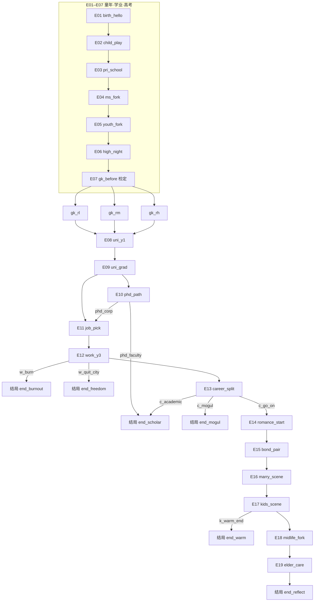

# 事件与分支编写指南（草稿）

> **状态**：草稿，未并入 `DEVELOPER.md`。确认与修改后再正式纳入仓库主文档。

本文面向在 `content/story.json` 中编排**阶段 → 场景 → 选项**的写作者，与当前引擎契约（`src/engine/schema.ts` + `scripts/validate-story.ts`）一致。

---

## 1. 结构总览

| 层级 | 文件字段                                                                                 | 说明                                                            |
| ---- | ---------------------------------------------------------------------------------------- | --------------------------------------------------------------- |
| 故事 | `meta`、`initial`、`stages[]`                                                      | 单文件承载全文；`meta.start` 为入口 `stageId` + `sceneId` |
| 阶段 | `stages[].id`、`title`、`scenes[]`                                                 | 人生阶段（时间轴上的「章」），`id` 需稳定、可引用             |
| 场景 | `scenes[].id`、`narrative`、`choices?`、`onEnter?`、`autoNext?`、`isEnding?` | 玩家停留的一屏叙事单位                                          |
| 选项 | `choices[]` 内每条 `Choice`                                                          | 玩家点击或键盘数字选择；可带效果、检定、显隐条件                |

**导航**：用 `next`（`Next`）从选项或检定区间跳到下一 `scene` 或跨 `stage`。同阶段内跳转可用 `{ "kind": "scene", "sceneId": "..." }`（可选 `stageId`）；跨阶段用 `{ "kind": "stage", "stageId": "...", "sceneId": "..." }`。

---

## 2. 全局状态（写分支前必懂）

初始值来自 `initial`，运行中由 `effects` 修改。

- **`stats`**（固定六维）：`stress`、`healthDebt`、`support`、`wealth`、`career`、`luck`。除 `healthDebt` 外 UI 常作 0–100 量纲理解；`healthDebt` 为非负累积。
- **`flags`**：`Record<string, boolean>`，适合「不可逆决断」（如「考上某校」）。
- **`tags`**：`string[]`，适合可叠加的习惯或长期标签（如与熬夜、压力相关）。

编写时：**命名用英文蛇形或简短英文**，避免与现有 `op`/字段拼写冲突；改稿时用全局搜索检查引用是否一致。

---

## 3. 选项 `Choice` 怎么写

每条至少包含：

- **`id`**：本场景内唯一（建议 `场景缩写_动作`，如 `gk_enter`）。
- **`label`**：玩家看到的文案。

可选字段：

| 字段            | 用途                                                                   |
| --------------- | ---------------------------------------------------------------------- |
| `effects`     | 选后立即应用的一组 `Effect`（见第 4 节）                             |
| `next`        | 无检定时**必须**：选后跳转目标                                   |
| `check`       | 阈值检定（见第 5 节）；有时**不要**根级 `next`，由检定区间导航 |
| `visibleWhen` | 仅当条件满足时显示该选项（分流、门槛）                                 |

### 3.1 条件显示 `visibleWhen`

满足**所有**已写字段时才显示（逻辑与 `src/engine/choiceVisibility.ts` 一致）：

- `tag`：全局 `tags` 中须包含该字符串。
- `flag`：`flags[key] === value`。
- `statMax`：对应 `stats[stat] <= value`（高于则隐藏）。
- `statMin`：对应 `stats[stat] >= value`（低于则隐藏）。

用于：中后期根据标签/标志/属性门槛展开不同选项，而不必复制整段场景。

---

## 4. 效果 `Effect`（`op`）

| `op`        | 字段                       | 含义                                           |
| ------------- | -------------------------- | ---------------------------------------------- |
| `addStat`   | `stat`, `value`        | 数值加减                                       |
| `setStat`   | `stat`, `value`        | 设为绝对值                                     |
| `clampStat` | `stat`, `min`, `max` | 夹逼到区间                                     |
| `setFlag`   | `key`, `value`         | 布尔决断点                                     |
| `addTag`    | `tag`                    | 追加标签（勿重复依赖引擎去重，习惯上策划自控） |
| `removeTag` | `tag`                    | 移除标签                                       |

**延迟后果**：没有单独的「延迟」语法；通过 **早期 `addTag` / `addStat`**，在 **后期场景的 `visibleWhen` 或叙事** 中体现，即「数据上连续、叙事上分期」。

---

## 5. 检定 `check`（`threshold`）

用于高考、面试等「一次掷骰、多档结果」：

- **`bands`**：若干 `{ min, max, label, next, effects? }`，与**结算分**比较；**所有区间的并集应覆盖 0–100**，否则运行时会报错。
- **`modifiers`**：可选，影响最终分数（如按 `career` 加权、`stressPenalty`、`luckWeight` 等，以代码实现为准）。

有 `check` 的选项：玩家选择后先出检定结果 UI，再导航到对应 `band` 的 `next`；根级可无 `next`。

---

## 6. 场景级：`onEnter` 与 `autoNext`

- **`onEnter`**：进入该场景时自动执行的一组 `Effect`（无需点击选项）。适合「到龄默认发生」「纯叙事扣属性」。
- **`autoNext`**：`{ next, delayMs? }`，叙事展示后自动跳转（`delayMs` 由 UI 使用，默认约 600ms）。用于纯过场、无选项推进。

---

## 7. 终局

- 将场景的 **`isEnding`** 设为 `true`，引擎会把 `phase` 切到结局界面。
- 该场景的 **`narrative`** 仍会在结局页作为可展示内容（与当前 `EndingScreen` 行为一致）。

---

## 8. 分支设计实务建议

1. **主 spine + 旁支**：用 `docs/story-routes.json` 一类摘要维护「主干时间线」，分支用 `branches.*` 记录关键岔路，避免 JSON 里迷路。
2. **汇聚**：不同 `next` 可指向同一后续 `sceneId`，靠 `flags`/`tags` 区分台词或小额 `onEnter` 差分。
3. **校验**：改稿后运行 `npm run validate:story`，避免拼错 `stageId`/`sceneId` 或 schema 违规。
4. **单局时长**：控制 `narrative` 总字数与选项屏数，与产品「约 3～5 分钟」对齐（见 `DEVELOPER.md`）。

---

## 9. 与代码的对应关系（便于检索）

| 概念     | 代码入口                                                          |
| -------- | ----------------------------------------------------------------- |
| Schema   | `src/engine/schema.ts`                                          |
| 选并解析 | `src/engine/machine.ts`（`selectChoice`、`resolveNext` 等） |
| 选项显隐 | `src/engine/choiceVisibility.ts`                                |
| 故事载入 | `src/store/gameStore.ts`（`content/story.json`）              |

---

## 10. 检定维度（策划语言）与数值如何驱动事件

本节用**四条策划向维度**描述玩家状态；引擎当前只认 `schema` 里的 `stats` / `flags` / `tags`（见第 2 节）。写作时先在脑内用四维思考，再在 JSON 里落到**具体字段**（见 10.1 映射）。维度本身不单独出现在 JSON 里，而是通过 **隐性的 `effects`** 改写数值，再通过 **`visibleWhen`**、**`onEnter`**、**检定 `modifiers`** 决定「哪些事件能刷出 / 被隐藏」「检定更容易进哪一档」。

| 策划维度 | 含义（玩家未必直接看到数字） | 典型隐性后果（示例） |
| -------- | ----------------------------- | -------------------- |
| **知识** | 课业、应试资本的积累 | 同一场景里选「多刷一科」会 +知识，利于后续检定加分档 |
| **健康** | 慢性消耗、病弱负担（越高越糟时，用负债型数值表示） | 熬夜、透支会 **恶化** 健康维度，后期可能锁出「就医/休养」线 |
| **压力** | 心态承压、焦虑 | 压力越高，同一场 **大考检定** 越容易落入「发挥失常」区间（靠 `stressPenalty` 等修饰符实现） |
| **体质** | 体能与恢复力，影响「扛不扛得住」高压日程 | 体质差时，同样熬夜对健康伤害更大；也可用于解锁「体育/医务」类选项 |

**刷出 / 隐藏事件** 的常用手段：

- **`visibleWhen.statMin` / `statMax`**：例如压力持续高于某阈值 → 出现「家长谈心」「心理咨询」选项；健康负担过高 → 出现「强制复查」场景入口。
- **`visibleWhen.tag`**：隐性选「连续熬夜」后打上 `tag`，后期某屏只对有该标签的玩家展示「身体报警」叙事。
- **`visibleWhen.flag`**：某次检定失败后 `setFlag`，后续场景从主线里**换皮**为补考/复读分支。

**阈值触发新分支**：当某一维（映射后的 `stat`）跨过策划预设的上下限时，**不自动跳转**——须通过在目标选项或场景的 `visibleWhen` 上写条件，让玩家「在满足条件时才看见这条路」，等价于「新事件分支被刷出」。

---

### 10.1 与当前引擎 `stats` 的映射（建议）

当前 `StatKeySchema` 为六维：`stress`、`healthDebt`、`support`、`wealth`、`career`、`luck`。四维策划语言可按下表落到 JSON（若日后 schema 扩展专用字段，再替换映射即可）。

| 策划维度 | 建议映射 | 说明 |
| -------- | -------- | ---- |
| **知识** | `career` | 叙事上视为「学业/应试资本」；`addStat career` 表示隐性涨知识 |
| **健康** | `healthDebt` | **负债型**：数值越高表示健康越差；「对健康 −1」在数据上常写作 `addStat healthDebt` 为 **正**（负担增加） |
| **压力** | `stress` | 与策划直觉一致；压力高用于 `statMin` 门槛或检定 `stressPenalty` |
| **体质** | `luck` + 可选 `tags` | 可用 `luck` 表示临场身体状态与恢复力；若需更强语义，可配合 `addTag: 体质透支` 等，用 `visibleWhen.tag` 锁分支 |

**检定如何把维度算进去**：在 `check.threshold.modifiers` 中，用 `addStatWeights` 给 `career`（知识）加权、`stressPenalty` 吃压力惩罚、`luckWeight` 关联体质/运气等（具体公式以 `src/engine` 检定实现为准）。策划表上写清：**「压力越高 → 扣分越多 → 越容易进低分 band」** 即可与实现对齐。

---

## 11. 完整事件链（`content/story.json` v2）

`meta.version` 为 **2.0.0**，`estimatedMinutes` 为 **[8, 15]**。以下与当前 JSON **逐条对齐**；**20 个交互点**用代号 **E01–E20** 标识（每个代号对应**至少一次玩家决策或一次检定**）。

**入口**：`birth` / `birth_hello`。

### 11.1 初始状态（`initial`）

| 字段 | 初值 |
|------|------|
| `stress` | 10 |
| `healthDebt` | 0 |
| `support` | 55 |
| `wealth` | 25 |
| `career` | 12 |
| `luck` | 50 |

---

### 11.2 交互点代号一览（E01–E20）

| 代号 | 场景 `sceneId` | 主题 | 选项数 / 备注 |
|------|----------------|------|----------------|
| **E01** | `birth_hello` | 诞生 | 1：推进时间 |
| **E02** | `child_play` | 幼年 | 1：进小学 |
| **E03** | `pri_school` | 小学 | 3：`pri_focus` / `pri_wide` / `pri_balance` |
| **E04** | `ms_fork` | 中学分流 | 3：`ms_key` / `ms_norm` / `ms_art` |
| **E05** | `youth_fork` | 初高中主轴 | 2：`y_gaokao` / `y_life` |
| **E06** | `high_night` | 高三熬夜 | 2：`grind_late` / `rest_ok` |
| **E07** | `gk_before` | **高考检定** | 1：`gk_enter` → `gaokao_main` 三档 → `gk_rl` / `gk_rm` / `gk_rh` |
| **E08** | `uni_y1` | 大学一年级 | 3：`u_club` / `u_gpa` / `u_intern` |
| **E09** | `uni_grad` | 毕业去向 | 3：`u_phd` / `u_work` / `u_public` |
| **E10** | `phd_path` **或** 跳过 | 读研出站 | **若选 `u_phd`**：2 选项 `phd_faculty` → **结局** 或 `phd_corp` → 职场；**若未读研** 本点不存在，直接进入 E11 |
| **E11** | `job_pick` | 第一份工作 | 3：`j_big` / `j_startup` / `j_stable` |
| **E12** | `work_y3` | 工作第三年 | 2～4：`w_climb` / `w_balance`；条件项 `w_burn`（`stress≥52`）→ **结局**；`w_quit_city`（`wealth≤45`）→ **结局** |
| **E13** | `career_split` | 事业中期 | 最多 3：`c_mogul`（`wealth≥38`）→ **结局**；`c_go_on` → 婚恋线；`c_academic`（需 `tag` **读研**）→ **结局** |
| **E14** | `romance_start` | 如何脱单 | 3：`r_active` / `r_blind` / `r_solo` |
| **E15** | `bond_pair` | 关系推进 | 3：`b_fast` / `b_slow` / `b_end` |
| **E16** | `marry_scene` | 婚否 | 2：`m_yes`（`setFlag married`）/ `m_no` |
| **E17** | `kids_scene` | 生育 / 丁克 / 收束 | 已婚：`k_yes` / `k_dink`；未婚仅 `k_skip`；条件 **`k_warm_end`**：`married` 且 **`support≥58`** → **幸福结局** |
| **E18** | `midlife_fork` | 中年去向 | 3：`mid_home` / `mid_stay`；`mid_start`（`wealth≥32`） |
| **E19** | `elder_care` | 体检与回望 | 2 互斥：`elder_soft`（`healthDebt≤40`）/ `elder_hard`（`healthDebt≥41`）→ **默认结局** |
| **E20** | **结局库** | 六类 `isEnding` | 见下表（非单一场景，为收束类型总称） |

**中途结局**（不必走到 E19）：`end_scholar`、`end_burnout`、`end_freedom`、`end_mogul`、`end_warm`，以及长线收束 `end_reflect`。

| 结局 `sceneId` | 触发路径（摘要） |
|----------------|------------------|
| `end_scholar` | `phd_path` → `phd_faculty`；或 `career_split` → `c_academic`（需 **读研**） |
| `end_burnout` | `work_y3` → `w_burn`（`stress≥52`） |
| `end_freedom` | `work_y3` → `w_quit_city`（`wealth≤45`） |
| `end_mogul` | `career_split` → `c_mogul`（`wealth≥38`） |
| `end_warm` | `kids_scene` → `k_warm_end`（`married` 且 `support≥58`） |
| `end_reflect` | `elder_care` 任一档 |

---

### 11.3 高考检定 `gk_before`（E07 详解）

- 选项：`gk_enter`，检定 id `gaokao_main`。  
- `modifiers`：`addStatWeights`（`career` 0.3）、`luckWeight` 0.12、`stressPenalty` 0.2。  
- **Bands**：0–28 → `gk_rl`；29–72 → `gk_rm`；73–100 → `gk_rh`（并设置 `gk_tier` 等）。  
- 三档结果场景各 **1 个 continue 选项** 进入 `uni_y1`（属性修正不同）。

---

### 11.4 条件选项速查（`visibleWhen`）

| 场景 | 选项 `id` | 条件 |
|------|-----------|------|
| `work_y3` | `w_burn` | `stress` **≥ 52** |
| `work_y3` | `w_quit_city` | `wealth` **≤ 45** |
| `career_split` | `c_mogul` | `wealth` **≥ 38** |
| `career_split` | `c_academic` | 含 `tag` **读研** |
| `kids_scene` | `k_yes` / `k_dink` | `flag` **married = true** |
| `kids_scene` | `k_skip` | `flag` **married = false** |
| `kids_scene` | `k_warm_end` | `married` 且 **`support` ≥ 58** |
| `midlife_fork` | `mid_start` | `wealth` **≥ 32** |
| `elder_care` | `elder_soft` | `healthDebt` **≤ 40** |
| `elder_care` | `elder_hard` | `healthDebt` **≥ 41** |

---

### 11.5 事件树（结构示意）

下图压缩了 **阶段合并与中途结局**；实线为主轴，虚线为**条件跳转至结局**。

**读图说明**：

- **E10**：仅当 `uni_grad` 选择 **`u_phd`** 时出现 `phd_path`；选 **`u_work` / `u_public`** 则 E10 跳过，**E11** 紧接 E09。  
- **E13** 三条出路：`c_mogul` / `c_academic` 直接进结局；`c_go_on` 进入婚恋线 E14–E17。  
- **E17** 在满足 `k_warm_end` 时可 **提前幸福结局**，否则进入中年 E18–E19。

---

*草稿版本随 `content/story.json` 演进需同步修订。*
