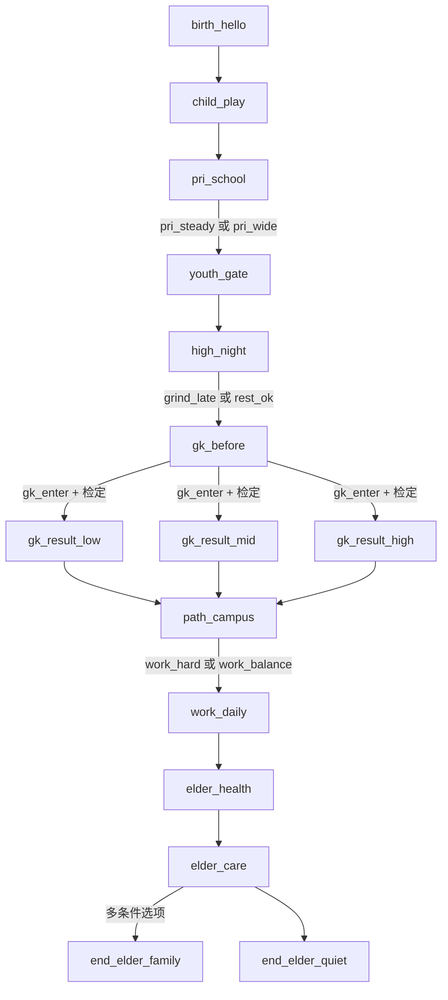

# 事件路线与随机说明（`content/story.json`）

供策划迭代：改剧情请优先改 `content/story.json`，再跑 `npm run validate:story`。

**与当前正文对齐**：**事件树、结局库、交互点代号（E01–E20）以 [`EVENT_BRANCHES.draft.md`](EVENT_BRANCHES.draft.md) §11 为准**（随 `content/story.json` **v2.2.0+**：**十四类**老年结局、`ms_voc`、中年标签等）；本文侧重 **RNG 说明**，下方阶段名/简图可能滞后，**一切以校验通过的 `story.json` 为准**。

---

## 1. 随机数基于什么？为何之前每局都一样？

### 引擎实现

- 使用 **Mulberry32** 伪随机数生成器（`src/engine/rng.ts`）。
- 种子 `seed` 经 **字符串哈希**（`hashSeed`）变成 32 位整数，再驱动同一序列；**同一 seed → 同一骰子序列**（便于测试复现）。
- **高考检定**（`threshold`）流程（`src/engine/check.ts`）：
  1. `rawRoll`：`floor(next01() * 101)`，即 **0～100 的整数**（展示为「骰值」）。
  2. 修正：按 `content/story.json` 里该检定的 `modifiers` 把 **职业、运气、压力** 等加权进 `score`，并 **clamp 到 0～100**（展示为「结算分」）。
  3. 用 `score` 落入哪一段 `bands`（`min`～`max`）决定 **文案档位**（失常 / 正常 / 超常）与后续场景。

### 行为变更（已修复）

- **此前**：每次点击「开始」仍使用 `meta.rngSeedDefault`（如 `life-demo`）作为种子 → 选择路径若相同，**高考及任意依赖 RNG 的节点结果会局局相同**。
- **现在**：每次 `startGame()` 会生成 **新的 `crypto.randomUUID()`**（不支持时用时间戳 + `Math.random` 兜底），**每局骰子序列不同**；若仍走完全相同选项，数值路径可能仍相似，但检定骰值会变化。

如需**固定种子**调试（例如录屏复现），可后续在设置里增加「种子输入框」——当前未做 UI。

---

## 2. 阶段总览（10 个 Stage）

| 顺序 | `stageId` | 标题 |
|------|-----------|------|
| 1 | `birth` | 诞生 |
| 2 | `childhood` | 幼年 |
| 3 | `primary` | 小学 |
| 4 | `youth` | 初中与高中 |
| 5 | `high_pressure` | 高三 |
| 6 | `gaokao` | 高考（含概率检定） |
| 7 | `path_open` | 大学与起步 |
| 8 | `work_life` | 职场与家庭 |
| 9 | `elder` | 中老年 |
| 10 | `ending` | 终章 |

---

## 3. 场景与选项路线图（简图）

---

## 4. 分支说明

### 小学 `pri_school`

| 选项 id | 标签 | 主要差异 |
|---------|------|----------|
| `pri_steady` | 按部就班，把基础打牢 | +career，+stress |
| `pri_wide` | 多试试兴趣，少盯分数 | +support，较少 career |

→ 均到 `youth / youth_gate`。

### 高三 `high_night`

| 选项 id | 标签 | 主要差异 |
|---------|------|----------|
| `grind_late` | 再熬一小时… | +career，+stress，+healthDebt，标签「熬夜」 |
| `rest_ok` | 准时睡… | 较低 career，减压，+support |

→ 均到 `gaokao / gk_before`。

### 高考检定 `gk_enter`（`check.id`: `gaokao`）

| 结算分区间 | 档位文案 | 下一场景 | 备注 |
|------------|----------|----------|------|
| 0–28 | 失常 | `gk_result_low` | `tier` flag false，+stress |
| 29–72 | 正常发挥 | `gk_result_mid` | `tier` true |
| 73–100 | 超常发挥 | `gk_result_high` | `tier` true，+career，+luck |

### 大学起步 `path_campus`

| 选项 id | 标签 | 主要差异 |
|---------|------|----------|
| `work_hard` | 加班换成长… | +wealth/career，+stress，+healthDebt，「熬夜」 |
| `work_balance` | 守住节奏… | +support，减压，较少 wealth |

→ 均到 `work_life / work_daily`。

### 中老年 `elder_health`（条件选项）

| 选项 id | 显示条件 | 标签 |
|---------|----------|------|
| `elder_ok` | `healthDebt ≤ 35` | 这些年还算平稳… |
| `elder_warn` | `healthDebt ≥ 36` | 慢性病与药盒… |

→ 到 `ending / end_elder_*`（`isEnding: true`，详见 `EVENT_BRANCHES.draft.md` §11）。

---

## 5. 与机器可读 JSON 的对应关系

结构化节点/边见同目录 [`story-routes.json`](story-routes.json)，可与本说明交叉对照。
