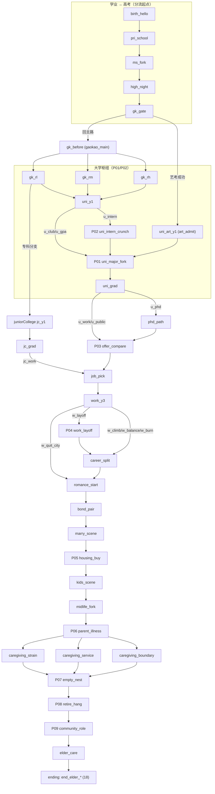
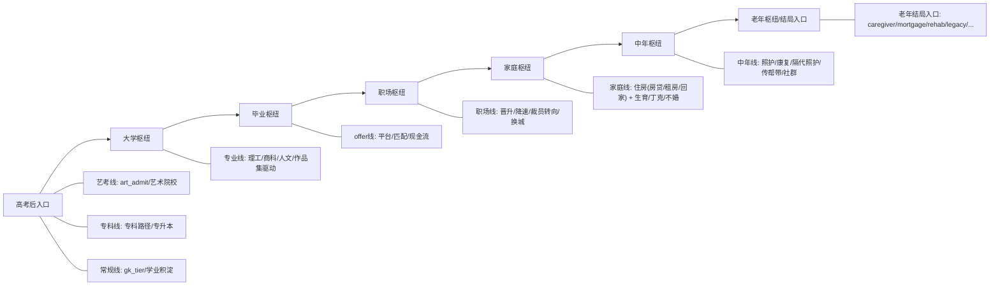

# 当前世界树（v2.6.0，草稿）

> 本文是从 `content/story.json`（`meta.version: 2.6.0`）抽象出的**世界树视图**，用于讨论“增加广度、不增加深度”的分支设计。  
> 事件细节与条件表仍以 [`EVENT_BRANCHES.draft.md`](EVENT_BRANCHES.draft.md) §11 为准。

---

## 1. 全量结构（主干 + 散叶）

---

## 2. “增加广度”的高考后世界线（不增加深度）

这张图只画 **高考后** 的枢纽层（大学/毕业/职场/家庭/中年/老年），每层横向展开世界线，但层级数不变。

---

## 3. 独特世界线（开始条件 / 合并点 / 结束状态）

- **艺术院校世界线**
  - **开始条件**：`flag art_admit = true`（`gk_gate` → `art_exam` 成功）
  - **合并点**：可在 `uni_grad`/`offer_compare` 合并回主线
  - **结束状态**：若保持差分，可更容易走向作品/legacy 类老年入口（如 `elder_cap_legacy`）

- **专科 → 专升本世界线**
  - **开始条件**：`tag 专科路径`（`gk_rl/from_rl_jc`）
  - **合并点**：`jc_upgrade` → `university/uni_y1`；或 `jc_work` → `offer_compare/job_pick`
  - **结束状态**：可与常规线高度合并，但在 `tags` 上保留“技能线/专升本”等差分点

- **照护 / 康复世界线**
  - **开始条件**：`tag 照护者`（照护优先）或 `tag 康复计划`（资源照护/健康优先）
  - **合并点**：仍会汇入 `elder_care`
  - **结束状态**：可直达更专属的老年结局入口：`end_elder_caregiver` / `end_elder_rehab`

- **房贷压力世界线**
  - **开始条件**：`tag 房贷`（`housing_buy/hb_buy`）
  - **合并点**：仍会汇入 `elder_care`
  - **结束状态**：若晚年 `wealth` 偏低，可走 `end_elder_mortgage`

---

*该文档用于视觉化讨论；若与运行时不一致，以 `content/story.json` 与 `npm run validate:story` 通过为准。*

