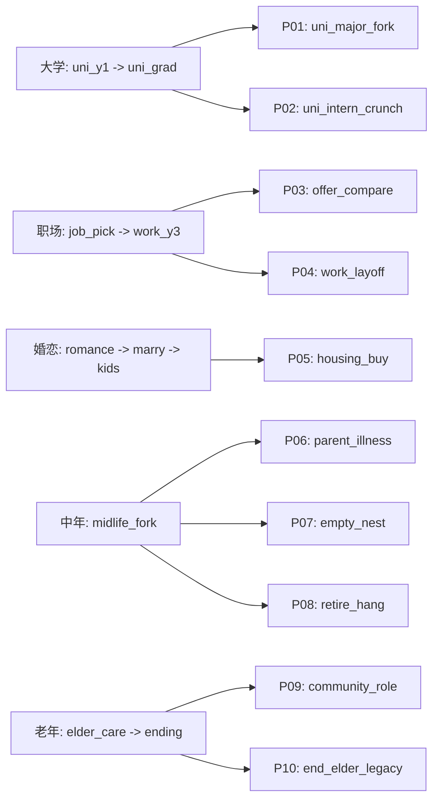

# 占位事件节点与世界树（策划草稿）

> **状态**：本文件用于管理「计划节点」；其中 **P02 / P04 已实装**（见下表），其余仍为占位。落地到 `content/story.json` 后需跑 `npm run validate:story`，并同步 [`EVENT_BRANCHES.draft.md`](EVENT_BRANCHES.draft.md) §11。

---

## 1. 与主线的关系

当前主线仍是一条时间轴：**诞生 → … → 高考 → 大学 → 职场 → 婚恋/家庭 → 中年 → 老年收束**。下表节点为 **在既有阶段之间或之内增加的「散叶」**，用于拉长决策链、让属性/标签更频繁地反馈到叙事。

---

## 2. 占位节点一览（无具体文案）

| 节点代号 | 建议插入位置（阶段 / 邻接场景） | 建议出现条件（概要） | 可能影响方向（非数值承诺） |
|----------|----------------------------------|----------------------|----------------------------|
| **P01** `major_fork`（✅已实装：`university/uni_major_fork`） | `university`，接在 `uni_y1` 与 `uni_grad` 之间 | 由 `uni_y1`（`u_club/u_gpa`）或 `uni_art_y1` 或 `uni_intern_crunch` 进入 | 专业分流打标签：`理工线`/`商科线`/`人文线`/（艺考成功）`作品集驱动`；影响后续 offer/职场/结局入口 |
| **P02** `intern_crunch`（✅已实装：`university/uni_intern_crunch`） | `university` | 由 `uni_y1` 的 `u_intern` 进入 | 实习高压二选一：更卷→`wealth/career/stress/healthDebt`↑ + `tag` 熬夜；立边界→`stress`↓、`support`↑ |
| **P03** `offer_compare`（✅已实装：`careerEarly/offer_compare`） | `careerEarly`，接在毕业与 `job_pick` 之间 | 由 `u_work/u_public`（以及专科 `jc_work`）进入 | 三选一：平台/匹配/现金流，分别偏向 `career`↑、`stress`↓+`support`↑、`wealth`↑ |
| **P04** `layoff_or_pivot`（✅已实装：`careerEarly/work_layoff`） | `careerEarly` | 在 `work_y3` 满足 `stress≥50` 且 `wealth≤40` 时出现 `w_layoff` | 裁员/转向三选一：补偿休整（`wealth`↑ `stress`↓ `tag` 休整）/ 转技能（`tag` 技能线）/ 靠关系（`support/luck`↑） |
| **P05** `housing_buy`（✅已实装：`familyRing/housing_buy`） | `familyRing`，接在 `marry_scene` 与 `kids_scene` 之间 | `m_yes` 或 `m_no` 后 | 三选一：买房（`tag` 房贷，`wealth`↓ `stress`↑）/租房（流动性）/回到家附近（`support`↑） |
| **P06** `parent_illness`（✅已实装：`lifeLate/parent_illness`） | `lifeLate`，接在 `midlife_fork` 后 | 由 `midlife_fork` 进入 | 三选一：照护优先（`tag` 照护者）/用钱换时间（`wealth`↓ `stress`↓）/保持距离（`stress`↓ `support`↓） |
| **P07** `empty_nest`（✅已实装：`lifeLate/empty_nest`） | `lifeLate`，接在 `parent_illness` 后 | 固定进入（可后续加条件） | 三选一：重连关系（`support`↑ `stress`↓）/继续加速（`wealth`↑ `stress`↑）/回到兴趣（`tag` 长期爱好） |
| **P08** `retire_hang`（✅已实装：`lifeLate/retire_hang`） | `lifeLate`，接在 `empty_nest` 后 | `wealth` 高时出现「规划退休」 | 规划/延后/软着陆，对 `stress` 与 `tags`（退休规划/软着陆）有影响 |
| **P09** `community_role`（✅已实装：`lifeLate/community_role`） | `lifeLate`，接在 `retire_hang` 与 `elder_care` 之间 | `support` 高时可「接过角色」 | 产生 `tag` 社群骨干，并提升 `support`，利于老年结局 `end_elder_community` |
| **P10** `legacy_hobby`（✅已实装：`ending/end_elder_legacy` + elder 入口 `elder_cap_legacy`） | `elder_care` → `ending` | `luck≥65` 可选 | 新增老年结局「留下些什么」，用于爱好/经验/作品的收束 |

---

## 3. 世界树结构（示意）

下图表示 **已落地** 与 **仍占位** 的叉路：实线为已落地，虚线为占位。

---

## 4. 落地时注意

1. 每个占位节点至少 **1 个入口 next** 与 **至少 1 个出口**，避免死图。  
2. 与 [`src/engine/schema.ts`](../src/engine/schema.ts) 中 `Choice` / `check` 契约一致。  
3. 高考检定算法以 **`src/engine/check.ts`** 为准，勿在本文件重复写死数值。

---

*草稿随策划讨论迭代；与 `story.json` 冲突时以仓库内 JSON 为准。*
